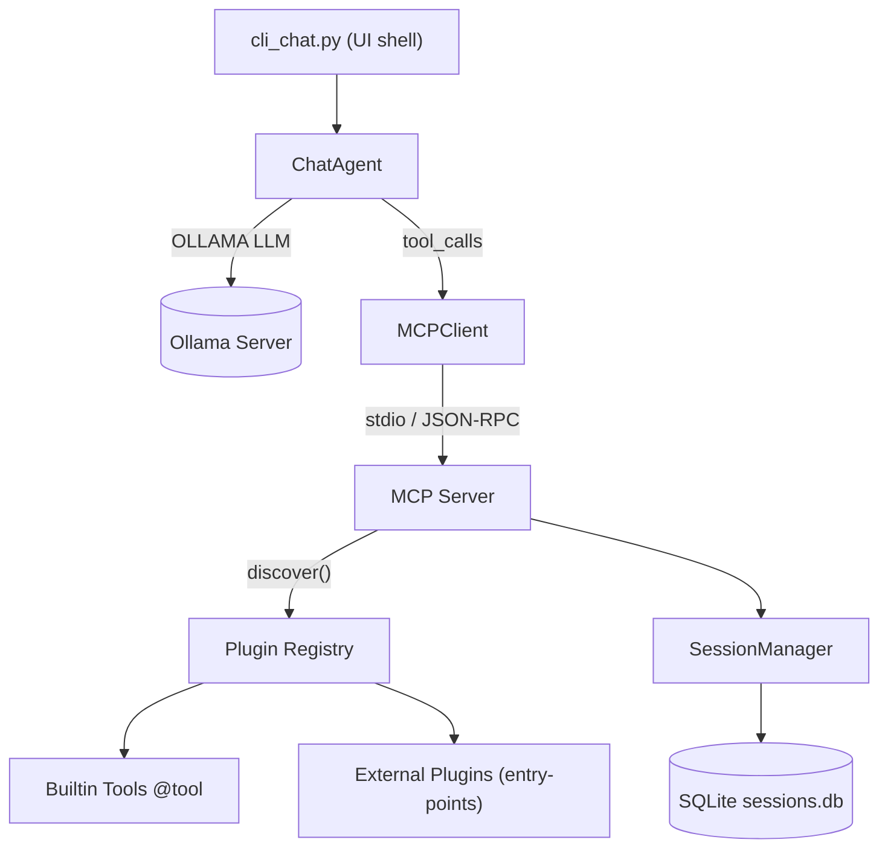

# 🤖 APE (Agentic Protocol Executor)

**A conversational AI system built on the Model Context Protocol (MCP) with persistent conversation management and intelligent tool integration.**

APE provides a sophisticated chat interface that leverages the [Model Context Protocol](https://github.com/modelcontextprotocol/python-sdk) to create an intelligent agent with database-backed session management, comprehensive conversation tools, and extensible functionality.

## ✨ Features

- 🔗 **MCP Protocol Compliance**: Built with the official [MCP Python SDK](https://github.com/modelcontextprotocol/python-sdk)
- 💾 **Persistent Sessions**: Asynchronous SQLite (aiosqlite) conversation storage and retrieval
- 🛠️ **8 Powerful Tools**: Database queries, conversation search, history management
- 🧠 **Multi-LLM Support**: Configurable Ollama integration with various models
- 📊 **Context Management**: Advanced context tracking across conversations
- 🎯 **CLI Interface**: Rich command-line experience with real-time tool feedback
- 🔍 **Conversation Search**: Full-text search across conversation history
- 📈 **Session Analytics**: Detailed session statistics and interaction tracking

## 🚀 Quick Start

### Prerequisites

- **Python 3.11+**
- **Conda** (recommended for environment management)
- **Ollama** (for LLM inference)

### Installation

#### 1. Setup Conda Environment

```bash
# Create and activate conda environment
conda create -n ape python=3.11
conda activate ape
```

#### 2. Install Ollama

**Linux/WSL:**
```bash
curl -fsSL https://ollama.ai/install.sh | sh
```

**macOS:**
```bash
brew install ollama
```

**Windows:**
Download from [ollama.ai](https://ollama.ai/download)

#### 3. Pull Required LLM Model

```bash
# Start Ollama service
ollama serve

# In another terminal, pull the default model
ollama pull qwen3:14b

# Or use a lighter model for testing
ollama pull qwen3:8b
```

#### 4. Install Python Dependencies

```bash
# Clone the repository
git clone <your-repo-url>
cd ape

# Install dependencies
pip install -r requirements.txt

# Or for development
pip install -e .
```

### Running APE

#### Start the CLI Chat Interface

```bash
python cli_chat.py
```

#### Test MCP Server Functionality

```bash
python test_mcp.py
```

#### Available CLI Commands

Once in the chat interface:

- `/help` - Show available commands
- `/history` - Display conversation history  
- `/session` - Show current session information
- `/tools` - List available MCP tools
- `/context` - Display current session context
- `/clear` - Clear screen
- `/reset` - Reset session context
- `/quit` - Exit the application

## 🏗️ Project Structure

```
ape/
├── ape/                          # Core package
│   ├── config.py                 # Configuration settings
│   ├── session.py                # Session management
│   ├── utils.py                  # Utility functions
│   ├── sessions.db               # SQLite database
│   └── mcp/                      # MCP implementation
│       ├── server.py             # MCP server with tool definitions
│       ├── implementations.py    # Tool implementation functions
│       └── session_manager.py    # Session management bridge
├── cli_chat.py                   # Main CLI interface (primary entry point)
├── mcp_server.py                 # MCP server entry point
├── tests/                        # Test suite
│   ├── unit/                     # Unit tests
│   └── integration/              # Integration tests
├── requirements.txt              # Python dependencies
├── pyproject.toml               # Project configuration
└── logs/                        # Application logs
```

### Core Components

#### **CLI Interface** (`cli_chat.py`)
- **ContextManager**: Tracks tool results and session context
- **APEChatCLI**: Main chat interface with MCP integration
- **Real-time tool execution** with visual feedback
- **Dynamic system prompts** based on available capabilities

#### **MCP Server** (`ape/mcp/`)
- **Protocol-compliant server** using official SDK
- **8 registered tools** for conversation and database management
- **Resource and prompt management** capabilities
- **Proper error handling** and logging

#### **Session Management** (`ape/session.py`)
- **Asynchronous SQLite (aiosqlite) persistence** with structured schema
- **JSON serialization** for complex data types
- **Thread-safe operations** with transaction support

## 🛠️ MCP Tools & Capabilities

APE implements the full MCP protocol with **Tools**, **Resources**, and **Prompts**:

### 🔧 Available Tools (8)

| Tool | Description | Use Case |
|------|-------------|----------|
| `execute_database_query` | Execute SQL queries (SELECT/INSERT/UPDATE/DELETE) | Database operations and analytics |
| `get_conversation_history` | Retrieve conversation history by session | Context retrieval and review |
| `get_database_info` | Database schema and statistics | System introspection |
| `search_conversations` | Full-text search across conversations | Finding specific discussions |
| `list_available_tools` | Tool introspection and capabilities | Understanding available functionality |
| `get_last_N_user_interactions` | Recent user messages | Understanding user patterns |
| `get_last_N_tool_interactions` | Recent tool usage | Tool usage analytics |
| `get_last_N_agent_interactions` | Recent AI responses | Response quality analysis |

### 📊 Resources

- **Session data**: Persistent conversation storage
- **Tool results**: Cached execution results with metadata
- **Context data**: Extracted values and session analytics

### 💬 Prompts

- **Dynamic system prompts**: Generated based on available tools and context
- **Interactive templates**: Context-aware conversation starters
- **Tool-specific prompts**: Optimized for different tool categories

## ⚙️ Configuration

### Configuration File (`ape/config.py`)

APE uses a Python configuration file with sensible defaults. No environment variables need to be exported unless you want to override the defaults:

```python
# Current default settings in ape/config.py
LLM_MODEL = "qwen3:14b"                    # Active LLM model
OLLAMA_BASE_URL = "http://localhost:11434" # Ollama server URL
LOG_LEVEL = "DEBUG"                        # Logging verbosity
UI_THEME = "dark"                          # Interface theme
SHOW_THOUGHTS = True                       # Display AI reasoning
PORT = 8000                                # Server port
```

### Optional Environment Variable Overrides

If you want to customize settings without modifying the code, you can set these environment variables:

```bash
# Optional: Override defaults with environment variables
export LLM_MODEL="qwen3:8b"               # Use lighter model
export OLLAMA_BASE_URL="http://remote:11434"  # Remote Ollama server
export LOG_LEVEL="INFO"                   # Less verbose logging
export UI_THEME="light"                   # Light theme
export SHOW_THOUGHTS="false"              # Hide AI reasoning
```

### Supported LLM Models

APE has been tested with various Ollama models:

- **qwen3:14b** (recommended) - Best balance of capability and performance
- **qwen3:8b** - Lighter alternative with good tool usage
- **llama3.1** - Tools capable but more rigid
- **gemma3:4b** - Lighter model with basic functionality

## 🧪 Testing

Run the comprehensive test suite:

```bash
# Run all tests
pytest tests/

# Run specific test categories
pytest tests/unit/test_mcp_server.py     # MCP server tests
pytest tests/unit/test_tool_diagnostics.py  # Tool functionality
pytest tests/integration/               # Integration tests

# Test MCP connectivity
python test_mcp.py
```

## 🔧 Development

### Adding New Tools

1. **Define tool schema** in `ape/mcp/server.py`:
```python
types.Tool(
    name="your_tool_name",
    description="Tool description",
    inputSchema={
        "type": "object",
        "properties": {
            "param": {"type": "string", "description": "Parameter description"}
        },
        "required": ["param"]
    }
)
```

2. **Implement function** in `ape/mcp/implementations.py`:
```python
async def your_tool_name_impl(param: str) -> str:
    # Implementation here
    return result
```

3. **Register handler** in `ape/mcp/server.py`:
```python
elif name == "your_tool_name":
    result = await your_tool_name_impl(arguments.get("param"))
    return [types.TextContent(type="text", text=result)]
```

### Database Schema

The system uses a simple but effective SQLite schema:

```sql
CREATE TABLE history (
    id INTEGER PRIMARY KEY AUTOINCREMENT,
    session_id TEXT NOT NULL,
    role TEXT NOT NULL,           -- 'user', 'assistant', 'system'
    content TEXT NOT NULL,
    images TEXT,                  -- JSON serialized image data
    timestamp DATETIME DEFAULT CURRENT_TIMESTAMP
);
```

## 📖 Documentation

- [Model Context Protocol Documentation](https://github.com/modelcontextprotocol/python-sdk)
- [MCP Specification](https://spec.modelcontextprotocol.io/)
- [Ollama Documentation](https://ollama.ai/docs)

## 🤝 Contributing

1. Fork the repository
2. Create a feature branch: `git checkout -b feature/amazing-feature`
3. Make your changes and add tests
4. Run the test suite: `pytest tests/`
5. Commit your changes: `git commit -m 'Add amazing feature'`
6. Push to the branch: `git push origin feature/amazing-feature`
7. Open a Pull Request

## 📄 License

This project is licensed under the MIT License - see the [LICENSE](LICENSE) file for details.

## 🙏 Acknowledgments

- [Model Context Protocol](https://github.com/modelcontextprotocol/python-sdk) - The official Python SDK that powers our MCP implementation
- [Ollama](https://ollama.ai/) - Local LLM inference engine
- [Loguru](https://github.com/Delgan/loguru) - Elegant logging solution

---

**APE - Bringing conversational AI to the next level with the Model Context Protocol** 🚀

## Architecture Overview



### Current Status (June 2025)

* **Configuration**: migrated to `pydantic-settings` (`ape/settings.py`). `.env` overrides supported.
* **CLI**: split into thin shell, `MCPClient`, `ChatAgent`, `ContextManager`.
* **Tools**: data-driven plugin system with `@tool` decorator and entry-point discovery (`ape.mcp.plugin`).
* **Integrity**: MCP server wraps every tool result in an HMAC-signed envelope; `ChatAgent` verifies.
* **Persistence**: migrated to asynchronous `aiosqlite` for non-blocking DB operations.

> For detailed roadmap and open tasks see `docs/ROADMAP.md` (TBD).

### Quick-start

```bash
# 1. clone and enter
git clone https://github.com/your-org/ape.git
cd ape

# 2. create virtualenv
python -m venv .venv && source .venv/bin/activate

# 3. install deps
pip install -r requirements.txt

# 4. ensure an Ollama model is pulled (example)
ollama pull qwen3:8b

# 5. export a NON-default HMAC key (prod)
export MCP_HMAC_KEY=$(openssl rand -hex 16)

# 6. launch chat
python cli_chat.py
```

### Configuration via `.env`
The project reads configuration from environment variables using `pydantic-settings`.
Create a local `.env` file at the repo root; any value there overrides the defaults.

```
# .env (example)
PORT=8080
LOG_LEVEL=INFO
OLLAMA_BASE_URL=http://localhost:11434
LLM_MODEL=qwen3:14b
TEMPERATURE=0.3
MAX_TOOLS_ITERATIONS=20
MCP_HMAC_KEY=changeme-super-secret
```

Run `python - <<'PY'
from ape.settings import settings, Settings; print(settings.model_dump_json(indent=2))
PY` to see the final merged configuration at runtime.
