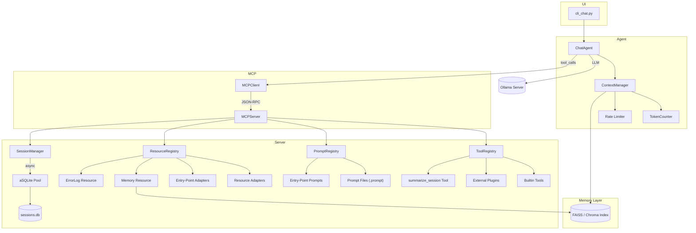

# 🤖 APE (Agentic Protocol Executor)

**A conversational AI system built on the Model Context Protocol (MCP) with persistent conversation management and intelligent tool integration.**

APE provides a sophisticated chat interface that leverages the [Model Context Protocol](https://github.com/modelcontextprotocol/python-sdk) to create an intelligent agent with database-backed session management, comprehensive conversation tools, and extensible functionality.

## ✨ Features

- 🔗 **MCP Protocol Compliance**: Built with the official [MCP Python SDK](https://github.com/modelcontextprotocol/python-sdk)
- 💾 **Persistent Sessions**: Asynchronous SQLite (aiosqlite) storage with **connection pooling**
- 🛠️ **9+ Tools**: Database queries, resource access, conversation search, history management, error inspection and more (auto-discovered)
- 🧠 **Multi-LLM Support**: Configurable Ollama integration with various models
- 🧮 **Token & Generation Controls**: Live token budgeting plus configurable temperature / top-p / top-k
- 🔒 **HS256-Signed JWT Results**: Each tool response is wrapped in a tamper-proof JWT (`MCP_JWT_KEY`, legacy `MCP_HMAC_KEY`)
- 🔌 **Plugin System**: Extend functionality via `ape_mcp.tools` entry-points — zero-code changes required
- ⚙️ **pydantic-settings Configuration**: Type-safe settings that can be overridden via a simple `.env` file
- 🎯 **CLI Interface**: Rich command-line experience with real-time tool feedback
- 🔍 **Conversation Search**: Full-text search across conversation history
- 📈 **Session Analytics**: Detailed session statistics and interaction tracking
- 📚 **Resource Registry**: Browse conversations & DB schema via URIs (`conversation://`, `schema://`) exposed over MCP
- 🧩 **Extensible Plugins**: Prompts & resource adapters discoverable via entry-points (`ape_prompts.dirs`, `ape_resources.adapters`)
- ⚡ **Lazy Imports**: Heavy dependencies (Pillow, transformers, ollama) load only when actually needed
- 📚 **Import-Light API**: `import ape; agent = ape.Agent(...)` – CLI extras no longer pulled in automatically
- 🛡️ **Structured Error Bus**: `tool_errors` table + `errors://recent` resource
- 🚨 **/errors Command**: Inspect per-session tool failures straight from the CLI
- 🤝 **Agent-to-Agent (A2A) Delegation**: `call_agent` tool planned for sub-task spawning

## 🚀 Quick Start

### Prerequisites

- **Python 3.11+**
- **Conda** (recommended for environment management)
- **Ollama** (for LLM inference)

### Installation

#### 1. Setup Conda Environment

```bash
# Create and activate conda environment
conda create -n ape python=3.11
conda activate ape
```

#### 2. Install Ollama

**Linux/WSL:**
```bash
curl -fsSL https://ollama.ai/install.sh | sh
```

**macOS:**
```bash
brew install ollama
```

**Windows:**
Download from [ollama.ai](https://ollama.ai/download)

#### 3. Pull Required LLM Model

```bash
# Start Ollama service
ollama serve

# In another terminal, pull the default model
ollama pull qwen3:14b

# Or use a lighter model for testing
ollama pull qwen3:8b
```

#### 4. Install Python Dependencies

```bash
# Clone the repository
git clone <your-repo-url>
cd ape

# Install core library (minimal runtime deps)
pip install .

# Optional extras
#   llm     → ollama + transformers
#   images  → Pillow for image manipulation
#   cli     → prompt_toolkit for fancy input
#   dev     → testing & formatting tools

# Example: full interactive install
pip install ".[llm,images,cli]"

# Development setup
pip install -e .[dev,llm,cli]
```

### Running APE

#### Start the CLI Chat Interface

```bash
python cli_chat.py
```

#### Test MCP Server Functionality

```bash
python test_mcp.py
```

#### Available CLI Commands  *(stop pretending you didn't need a crib sheet)*

Once in the chat interface:

- `/help` - Show available commands
- `/history` - Display conversation history  
- `/session` - Show current session information
- `/tools` - List available MCP tools
- `/context` - Display current session context
- `/errors`  - Show recent **per-session** tool errors (no cross-agent noise)
- `/clear` - Clear screen
- `/reset` - Reset session context
- `/quit` - Exit the application

## 🏗️ Project Structure

```
ape/
├── ape/                          # Core package
│   ├── settings.py               # Configuration settings
│   ├── session.py                # Session management
│   ├── db_pool.py               # aiosqlite connection pool
│   ├── mcp/                      # MCP implementation
│   │   ├── server.py             # MCP server with tool definitions
│   │   ├── implementations.py    # Tool implementation functions
│   │   └── session_manager.py   # Async Session management
│   ├── cli_chat.py                   # Main CLI interface (primary entry point)
│   ├── mcp_server.py                 # MCP server entry point
│   ├── tests/                        # Test suite
│   │   ├── unit/                     # Unit tests
│   │   └── integration/              # Integration tests
│   ├── requirements.txt              # Python dependencies
│   ├── docs/                         # Markdown documentation & guides
│   ├── findings/                     # Design reviews and technical notes
│   └── logs/                         # Application logs
```

### Core Components

#### **CLI Interface** (`cli_chat.py`)
- **ContextManager**: Tracks tool results and session context
- **APEChatCLI**: Main chat interface with MCP integration
- **Real-time tool execution** with visual feedback
- **Dynamic system prompts** based on available capabilities

#### **MCP Server** (`ape/mcp/`)
- **Protocol-compliant server** using official SDK
- **8 registered tools** for conversation and database management
- **Resource and prompt management** capabilities
- **Proper error handling** and logging

#### **Session Management** (`ape/mcp/session_manager.py`)
- **Asynchronous SQLite (aiosqlite) persistence** via connection pool (`db_pool.py`)
- **JSON serialization** for complex data types
- **Concurrent-safe operations** with WAL mode

## 🛠️ MCP Tools & Capabilities

APE implements the full MCP protocol with **Tools**, **Resources**, and **Prompts**:

### 🔧 Available Tools (8)

| Tool | Description | Use Case |
|------|-------------|----------|
| `execute_database_query` | Execute SQL queries (SELECT/INSERT/UPDATE/DELETE) | Database operations and analytics |
| `get_conversation_history` | Retrieve conversation history by session | Context retrieval and review |
| `get_database_info` | Database schema and statistics | System introspection |
| `search_conversations` | Full-text search across conversations | Finding specific discussions |
| `list_available_tools` | Tool introspection and capabilities | Understanding available functionality |
| `get_last_N_user_interactions` | Recent user messages | Understanding user patterns |
| `get_last_N_tool_interactions` | Recent tool usage | Tool usage analytics |
| `get_last_N_agent_interactions` | Recent AI responses | Response quality analysis |
| `read_resource` | Read any registry resource by URI (`conversation://*`, `schema://*`, …) | Access conversation snapshots, DB schema, etc. |

### 📊 Resources

- **Session data**: Persistent conversation storage
- **Tool results**: Cached execution results with metadata
- **Context data**: Extracted values and session analytics

### 💬 Prompts

- **Dynamic system prompts**: Generated based on available tools and context
- **Interactive templates**: Context-aware conversation starters
- **Tool-specific prompts**: Optimized for different tool categories

## ⚙️ Configuration

### Configuration File (`ape/settings.py`)

APE relies on `pydantic-settings`; every field below can be overridden with environment variables or a `.env` file at the repository root.

```python
# Defaults as of June 2025
PORT = 8000                      # MCP server port
LOG_LEVEL = "INFO"               # Runtime verbosity – DEBUG spam is now confined to logs
OLLAMA_BASE_URL = "http://localhost:11434"  # Ollama server URL
LLM_MODEL = "qwen3:8b"           # Default model pulled via Ollama
TEMPERATURE = 0.5                # Sampling temperature
MAX_TOOLS_ITERATIONS = 15        # Max reasoning/tool loops per prompt
TOP_P = 0.9                      # Nucleus sampling (probability mass)
TOP_K = 40                       # Top-K sampling (candidate pool)
UI_THEME = "dark"                # CLI theme (dark/light)
SHOW_THOUGHTS = True             # Stream <think> content from the LLM
MCP_JWT_KEY = "dev-secret"      # Shared secret for tool-result signatures
SESSION_DB_PATH = "ape/sessions.db"  # SQLite conversation store
```

### Optional Environment Variable Overrides

```bash
# Example .env / shell overrides
LLM_MODEL=qwen3:14b               # Use a larger model
TEMPERATURE=0.3
TOP_P=0.95
TOP_K=50
MAX_TOOLS_ITERATIONS=20
MCP_JWT_KEY=$(openssl rand -hex 16)  # Strong key for production
```

### Supported LLM Models

APE has been tested with various Ollama models:

- **qwen3:14b** (recommended) - Best balance of capability and performance
- **qwen3:8b** - Lighter alternative with good tool usage
- **llama3.1** - Tools capable but more rigid
- **gemma3:4b** - Lighter model with basic functionality. Only tested with `PetrosStav/gemma3-tools:4b`

## 🧪 Testing

Run the full test suite or focus on a subset:

```bash
# Run all tests
pytest tests/

# Specific modules
pytest tests/unit/test_mcp_server.py
pytest tests/unit/test_chat_functionality.py
pytest tests/integration/

# Quick MCP connectivity check
python test_mcp.py
```

## 🔧 Development

### Adding New Tools

1. **Define tool schema** in `ape/mcp/server.py`:
```python
types.Tool(
    name="your_tool_name",
    description="Tool description",
    inputSchema={
        "type": "object",
        "properties": {
            "param": {"type": "string", "description": "Parameter description"}
        },
        "required": ["param"]
    }
)
```

2. **Implement function** in `ape/mcp/implementations.py`:
```python
async def your_tool_name_impl(param: str) -> str:
    # Implementation here
    return result
```

3. **Register handler** in `ape/mcp/server.py`:
```python
elif name == "your_tool_name":
    result = await your_tool_name_impl(arguments.get("param"))
    return [types.TextContent(type="text", text=result)]
```

### Database Schema

The system uses a simple but effective SQLite schema:

```sql
CREATE TABLE history (
    id INTEGER PRIMARY KEY AUTOINCREMENT,
    session_id TEXT NOT NULL,
    role TEXT NOT NULL,           -- 'user', 'assistant', 'system'
    content TEXT NOT NULL,
    images TEXT,                  -- JSON serialized image data
    timestamp DATETIME DEFAULT CURRENT_TIMESTAMP
);
```

## 📖 Documentation

- [Model Context Protocol Documentation](https://github.com/modelcontextprotocol/python-sdk)
- [MCP Specification](https://spec.modelcontextprotocol.io/)
- [Ollama Documentation](https://ollama.ai/docs)

## 🤝 Contributing

1. Fork the repository
2. Create a feature branch: `git checkout -b feature/amazing-feature`
3. Make your changes and add tests
4. Run the test suite: `pytest tests/`
5. Commit your changes: `git commit -m 'Add amazing feature'`
6. Push to the branch: `git push origin feature/amazing-feature`
7. Open a Pull Request

## 📄 License

This project is licensed under the MIT License - see the [LICENSE](LICENSE) file for details.

## 🙏 Acknowledgments

- [Model Context Protocol](https://github.com/modelcontextprotocol/python-sdk) - The official Python SDK that powers our MCP implementation
- [Ollama](https://ollama.ai/) - Local LLM inference engine
- [Loguru](https://github.com/Delgan/loguru) - Elegant logging solution

---

**APE - Bringing conversational AI to the next level with the Model Context Protocol** 🚀

## Architecture Overview



### Current Status (June 2025)

* **Configuration**: migrated to `pydantic-settings` (`ape/settings.py`). `.env` overrides supported.
* **CLI**: split into thin shell, `MCPClient`, `ChatAgent`, `ContextManager`.
* **Tools**: data-driven plugin system with `@tool` decorator and entry-point discovery (`ape.mcp.plugin`).
* **Integrity**: MCP server wraps every tool result in an HMAC-signed envelope; `ChatAgent` verifies.
* **Token budgeting**: agent counts tokens live and warns on context overflow; *hybrid summarisation policy* (overflow-only) scheduled.
* **Prompt registry**: Implemented – prompt templates (`*.prompt.md`) now reside in `ape/prompts/templates/`, loaded via Jinja2, hot-reloaded, and exposed through MCP.
* **Resource registry**: Implemented – access conversation & DB schema data via `conversation://*` and `schema://*` URIs; discoverable through MCP `list_resources`.
* **Memory roadmap**: `AgentMemory` abstraction + `WindowMemory` implementation in progress; vector memory slated for next milestone.
* **Persistence**: migrated to asynchronous `aiosqlite` for non-blocking DB operations.

> For detailed roadmap and open tasks see `docs/ROADMAP.md` (TBD).

### Quick-start

```bash
# 1. clone and enter
git clone https://github.com/your-org/ape.git
cd ape

# 2. create virtualenv
python -m venv .venv && source .venv/bin/activate

# 3. install deps
pip install -r requirements.txt

# 4. ensure an Ollama model is pulled (example)
ollama pull qwen3:8b

# 5. export a strong shared secret for JWT signing (prod)
export MCP_JWT_KEY=$(openssl rand -hex 16)

# 6. launch chat
python cli_chat.py
```

### Configuration via `.env`
The project reads configuration from environment variables using `pydantic-settings`.
Create a local `.env` file at the repo root; any value there overrides the defaults.

```
# .env (example)
PORT=8080
LOG_LEVEL=INFO
OLLAMA_BASE_URL=http://localhost:11434
LLM_MODEL=qwen3:14b
TEMPERATURE=0.3
TOP_P=0.95
TOP_K=50
MAX_TOOLS_ITERATIONS=20
MCP_JWT_KEY=changeme-super-secret
```

Run `python - <<'PY'
from ape.settings import settings; print(settings.model_dump_json(indent=2))
PY` to view the final merged configuration at runtime.