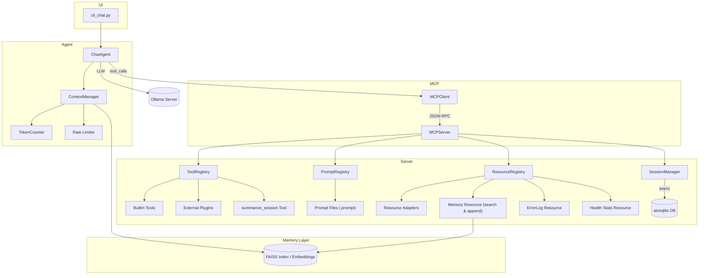

# 🛠️ Enhanced Development Plan for APE
# Generated: 2025-06-12

## 1. Key Findings
1. The MCP integration is solid, but
   - ~~Request/response payloads use ad-hoc dicts (risk of schema drift).~~ ✅ Replaced with *Pydantic* `ToolCall` / `ToolResult` / `ErrorEnvelope` models.
   - Errors from tool calls are not persisted in a structured way.
   - Token counting currently requires a second Ollama call.
   - Context-window trimming is manual / size-blind.
   - No embeddings or RAG memory yet; retrieval would boost long-term reasoning.
   - Prompts & Resources are not yet exposed via MCP endpoints.
   - Plugin discovery only covers Tools, not Prompts/Resources.
   - HMAC signing is present, but key handling & expiry could be improved.

## 2. Immediate Objectives (📅 Sprint-0)
| Priority | Task | Owner | Notes |
|----------|------|-------|-------|
| P0 | **Done** | dev-backend | Delivered in latest refactor |
| P0 | Introduce `TokenCounter` (local tokenizer) | dev-agent | use `tiktoken` (Qwen) or `sentencepiece` |
| P1 | **Done** – Pydantic models formalised (`ToolCall`, `ToolResult`, `ErrorEnvelope`) | dev-backend | Implemented in `ape/mcp/models.py` and integrated server ↔ agent |
| P1 | Sliding context-window logic based on live token count | dev-agent | integrate with `ContextManager` |
| P1 | Central error bus + DB persistence | dev-backend | new table `tool_errors` |
| P2 | Prompt / Resource registry + MCP handlers | dev-backend | parity with `tools` feature |
| P2 | Extend plugin discovery to Prompts/Resources | dev-platform | unify entry-point group |
| P2 | Implement `.prompt` file loader for easy authoring | dev-platform | optional `.prompt.py` functions |
| P3 | HMAC-JWT envelope w/ expiry & issuer | dev-security | `.env` for secret/key rotation |
| P3 | Embeddings & FAISS memory index | dev-ml | start with MiniLM-L6 or `bge-small` |
| P3 | Expose `memory://search?q=` Resource | dev-ml | read-only, returns top-k snippets |
| P3 | Memory append tool `memory_append` | dev-ml | agent can write memories to RAG store |
| P3 | ErrorLog resource `errors://recent` | dev-backend | model can inspect recent tool errors |
| P3 | Prompt list resource `prompts://list` | dev-backend | exposes prompt metadata/version |
| P3 | Summarize session tool `summarize_session` | dev-agent | stores TL;DR into embedding index |
| P3 | Rate-limiting middleware | dev-platform | prevents runaway tool loops |
| P3 | Embedding backend abstraction | dev-ml | hot-swap MiniLM/BGE/Ollama embeddings |
| P3 | Telemetry resource `health://stats` | dev-platform | uptime & latency metrics |
| P3 | Online prompt authoring UI | dev-frontend | web/cli playground for `.prompt` templates |
| P3 | Self-inspect tool `self_inspect` | dev-agent | agent can query its own state & limits |
| P3 | Reflection logger (writes to memory) | dev-agent | post-tool call success/failure notes |
| P4 | Plugin marketplace scaffold | dev-platform | docs + entry-point registry for community |
| P4 | Distributed agent federation PoC | dev-research | remote MCP peer discovery & trust |

## 3. Milestones
1. **Completed**
   - All chat/database ops are now awaitable; DB layer uses `aiosqlite`.
2. **M1 – Safe & Typed IPC (P0 + P1)** *(in progress)*
   - ✅ Pydantic schemas integrated.  
   - ⏳ Next: error bus persistence, token counter, context hygiene.
3. **M2 – Discovery Parity (P2)**
   - Prompts, Resources discoverable; plugin framework unified.
4. **M3 – Memory-Augmented Agent (P3)**
   - Embedding store, RAG resource, improved recall.
5. **M4 – Security Hardened (P3)**
   - JWT-style envelopes, secret rotation, CI gate for secrets.
5. **M5 – Community & UI**
   - Prompt authoring UI, plugin marketplace, rich docs.
6. **M6 – Research / Federation**
   - Distributed agents, online learning hooks.

## 4. Technical Notes
- **aiosqlite**: supports same SQL; wrap existing calls in `async with aiosqlite.connect(...)`.
- **Tokenizer**: Qwen tokeniser ≈ tiktoken `qwen.tiktoken`; fallback to `cl100k_base`.
- **Error Bus**: simple dataclass → JSON → DB; add `/errors` CLI command.
- **Embeddings**: store `(message_id, vector)`; rebuild index lazily.
- **FAISS**: keep index on disk under `./vector_store/`.

## 5. Testing / CI
- Unit tests for async DB, token counting edge-cases
- Integration tests: tool call → error persists
- Memory search returns deterministic top-k

## 6. Open Questions
1. Do we need multi-tenant session isolation now or later?
2. Which embedding model balances speed ↔ memory best on WSL2?
3. Should prompts live as markdown templates or Python functions?

## 7. Next Review
Schedule design-review meeting once **M1** tasks reach PR-ready state or by **2025-06-20**, whichever comes first.

## 8. Proposed Enhanced Architecture

## 9. Expert-Level Recommendations Incorporated
- **Protocol symmetry**: Prompts & Resources now share the unified plugin registry.
- **Hybrid Memory**: vector backend abstraction planned (FAISS ⇄ remote DB).
- **Writeable reflections**: `reflection_logger` & `self_inspect` tools enable meta-reasoning.
- **Security & audit**: JWT signing retained; audit trail via ErrorLog & Memory logs.
- **Community growth**: Marketplace scaffold and prompt UI scheduled for M5.
- **Research path**: Federation PoC & online learning targeted for M6. 